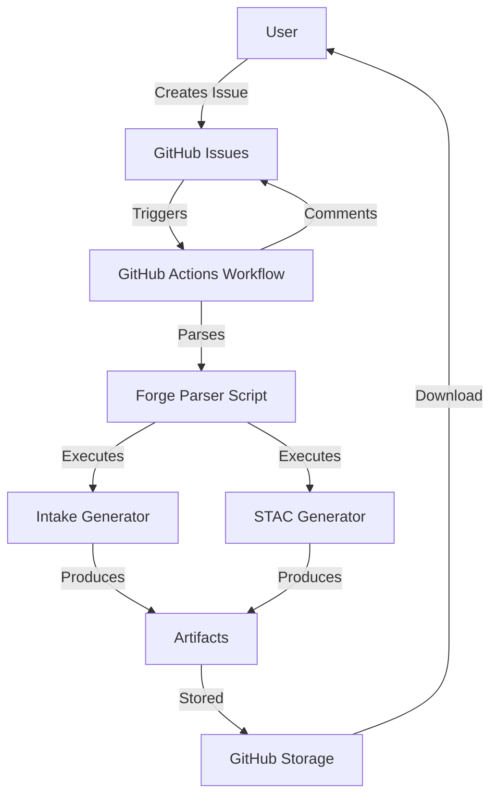

# Forge Architecture

This document describes the technical architecture of the catalog forge system.

## Overview

The forge is an automated catalog generation system that uses GitHub Issues as input and GitHub Actions as the execution engine. It converts GitHub Issues into catalog generation jobs and publishes results as downloadable artifacts.

## System Components



### 1. Issue Templates

**Location:** `.github/ISSUE_TEMPLATE/`

**Purpose:** Provide structured forms for users to request catalog generation

**Files:**
- `forge-intake.yml` - Intake v2 catalog generation
- `forge-stac.yml` - STAC catalog generation
- `config.yml` - Template configuration

**Features:**
- YAML-based GitHub Issue Forms
- Input validation
- Required/optional fields
- Dropdowns and checkboxes
- Auto-applied labels

### 2. GitHub Actions Workflows

**Location:** `.github/workflows/`

#### Main Workflow: `forge-catalog.yml`

**Triggers:**
- Issue opened with `forge-intake` or `forge-stac` label
- Label added to existing issue

**Jobs:**
1. **parse-and-forge**
   - Checks labels to determine catalog type
   - Sets up Python environment
   - Installs appropriate dependencies
   - Runs forge parser
   - Uploads artifacts
   - Comments results on issue
   - Adds status label

**Permissions:**
- `issues: write` - Comment on issues and add labels
- `contents: read` - Read repository contents

#### Test Workflow: `test-forge.yml`

**Purpose:** Validate forge parser and workflows in CI

**Triggers:**
- Pull requests affecting forge files
- Pushes to main branch
- Manual workflow dispatch

**Jobs:**
- Test parser with multiple Python versions
- Dry-run both catalog types
- Upload test artifacts

### 3. Forge Parser Script

**Location:** `.github/scripts/forge_parser.py`

**Purpose:** Bridge between GitHub Issues and catalog generators

**Architecture:**

```python
main()
  ├── parse_issue_body()      # Extract fields from issue
  ├── create_output_dir()     # Setup output directory
  ├── run_intake_forge()      # For intake catalogs
  │   ├── Build command
  │   ├── Execute subprocess
  │   └── Handle results
  └── run_stac_forge()        # For STAC catalogs
      ├── Parse parameters
      ├── Generate STAC JSON
      └── Create documentation
```

**Input:** Environment variables
- `ISSUE_BODY` - Full issue body text
- `ISSUE_NUMBER` - Issue number
- `CATALOG_TYPE` - Type (intake/stac)

**Output:** Files in `forge_output/`
- Generated catalog files
- `info.txt` - Metadata about generation
- `stdout.log` - Command output
- `stderr.log` - Error output
- `error.log` - Failure details (on error)

### 4. Catalog Generators

#### Intake Generator

**Module:** `generators.intake.v2.tointake2`

**Execution:** Called as subprocess
```bash
python -m generators.intake.v2.tointake2 <source_uri> --out <output>
```

**Supported Inputs:**
- Intake v1 YAML catalogs
- Zarr stores (local/remote)
- Kerchunk reference Parquet
- NetCDF files

#### STAC Generator

**Module:** `generators.stac`

**Current Implementation:** Placeholder (generates basic collection)

**Future:** Full STAC item generation with xarray integration

### 5. Local Testing Tools

#### `tests/test_forge.py`

**Purpose:** Local simulation of forge workflow

**Features:**
- Simulates issue body creation
- Sets environment variables
- Calls forge parser
- Reports results

**Usage:**
```bash
python tests/test_forge.py intake --uri <url> --name <name>
python tests/test_forge.py stac --uri <url> --collection <id> --project <id>
```

### 6. Documentation

**Files:**
- `FORGE.md` - User guide
- `FORGE_EXAMPLES.md` - Example scenarios
- `FORGE_ARCHITECTURE.md` - This file
- `.github/LABELS.md` - Label documentation

## Data Flow

### Successful Generation

```
1. User creates issue with template
   ↓
2. GitHub applies label (forge-intake/forge-stac)
   ↓
3. Workflow triggers on label
   ↓
4. Parser extracts fields from issue body
   ↓
5. Generator executes with extracted parameters
   ↓
6. Output files saved to forge_output/
   ↓
7. Artifact uploaded to GitHub
   ↓
8. Success comment added to issue
   ↓
9. forge-complete label applied
   ↓
10. User downloads artifact (90 day retention)
```

### Failed Generation

```
1-5. (Same as successful flow)
   ↓
6. Generator returns error
   ↓
7. Error log created in forge_output/
   ↓
8. Artifact uploaded (includes error.log)
   ↓
9. Failure comment added to issue
   ↓
10. forge-failed label applied
   ↓
11. User reviews error log
```

## Security Model

### Isolation

- Each forge runs in isolated GitHub Actions runner
- No persistent state between runs
- Clean environment for each execution

### Access Control

- Public repositories: Anyone can create issues
- Private repositories: Requires read access
- Artifacts: Require repository read access to download

### Resource Limits

- **Timeout:** 10 minutes per command, 60 minutes per workflow
- **Artifact Size:** 10 GB maximum
- **Artifact Retention:** 90 days
- **Concurrent Jobs:** Per GitHub's limits (typically 20 for free tier)

### Input Validation

- Issue templates provide basic validation
- Parser validates required fields
- Generators validate inputs before processing
- URLs must be accessible from GitHub runners

## Extensibility

### Adding New Catalog Type

1. **Create Issue Template**
   ```yaml
   # .github/ISSUE_TEMPLATE/forge-newtype.yml
   name: Generate NewType Catalog
   labels: ["forge-newtype"]
   ```

2. **Update Workflow**
   ```yaml
   # .github/workflows/forge-catalog.yml
   if: contains(github.event.issue.labels.*.name, 'forge-newtype')
   ```

3. **Add Parser Handler**
   ```python
   # .github/scripts/forge_parser.py
   def run_newtype_forge(fields, output_dir):
       # Implementation
   ```

4. **Create Generator** (if needed)
   ```python
   # src/generators/newtype/generator.py
   ```

5. **Add Tests**
   ```python
   # tests/test_forge.py - add newtype subcommand
   ```

6. **Document**
   - Add examples to FORGE_EXAMPLES.md
   - Update FORGE.md
   - Create label

### Adding New Options

Modify the issue template to include new fields:

```yaml
- type: input
  id: new-option
  attributes:
    label: New Option
    description: Description of new option
```

Then update the parser to extract and use the field.

## Error Handling

### Levels

1. **Template Validation** - GitHub validates form inputs
2. **Field Extraction** - Parser validates presence of required fields
3. **Generator Execution** - Subprocess handles generator errors
4. **Output Creation** - File system operations wrapped in try/catch

### Error Recovery

- Logs saved even on failure
- Partial outputs preserved in artifacts
- Error messages include actionable suggestions
- Failed jobs can be manually re-triggered

## Performance Considerations

### Optimization Strategies

1. **Dependency Caching**
   - Pip cache enabled in workflows
   - Reduces setup time from ~2min to ~30sec

2. **Parallel Execution**
   - Multiple issues process concurrently
   - Limited by GitHub's concurrency limits

3. **Timeout Management**
   - 10 minute command timeout prevents hanging
   - Extendable for known long-running operations

4. **Artifact Compression**
   - GitHub automatically compresses artifacts
   - Reduces storage and download time

### Scalability

- **Current:** Handles dozens of concurrent requests
- **Bottleneck:** GitHub Actions concurrency limits
- **Future:** Could move to external compute for heavy loads

## Monitoring and Debugging

### Log Levels

1. **GitHub Actions Logs** - Full workflow execution
2. **stdout.log** - Generator standard output
3. **stderr.log** - Generator warnings
4. **error.log** - Detailed errors (on failure)
5. **info.txt** - Generation metadata

### Debugging Workflow

1. Check issue comment for high-level status
2. Download artifact to inspect outputs
3. Review GitHub Actions logs for workflow issues
4. Use `tests/test_forge.py` to reproduce locally
5. Check generator logs for detailed errors

### Metrics to Monitor

- Success rate (forge-complete vs forge-failed labels)
- Average execution time
- Artifact sizes
- Error patterns

## Future Enhancements

### Planned Features

1. **Full STAC Item Generation**
   - Currently only creates collections
   - Need xarray integration for items

2. **Direct STAC API Publishing**
   - Push generated catalogs to STAC API
   - Requires authentication handling

3. **Private Data Support**
   - Support for authenticated data sources
   - Secure credential management

4. **Email Notifications**
   - Notify users when catalogs are ready
   - Requires GitHub App or external service

5. **Scheduled Updates**
   - Refresh dynamic catalogs on schedule
   - Track changes over time

6. **Validation Step**
   - Preview before full generation
   - Estimate costs/time
   - Allow user confirmation

7. **Integration with Storage**
   - Directly publish to S3, Swift, etc.
   - Skip artifact download/upload cycle

### Technical Debt

- STAC generator currently placeholder
- Error handling could be more granular
- Need integration tests
- Documentation could include videos/screenshots

## Related Technologies

- **GitHub Actions** - CI/CD platform
- **GitHub Issue Forms** - Structured issue templates
- **Intake** - Data cataloging system
- **STAC** - SpatioTemporal Asset Catalog spec
- **Python** - Implementation language
- **YAML/JSON** - Catalog formats

## References

- [GitHub Actions Documentation](https://docs.github.com/en/actions)
- [GitHub Issue Forms](https://docs.github.com/en/communities/using-templates-to-encourage-useful-issues-and-pull-requests/syntax-for-issue-forms)
- [Intake Documentation](https://intake.readthedocs.io/)
- [STAC Specification](https://stacspec.org/)
