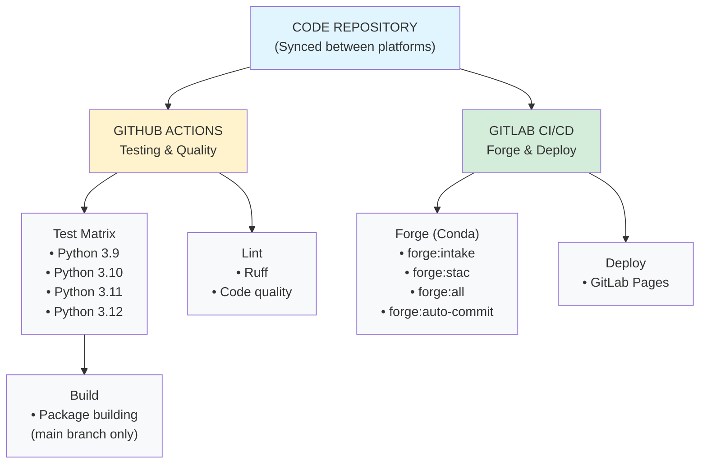
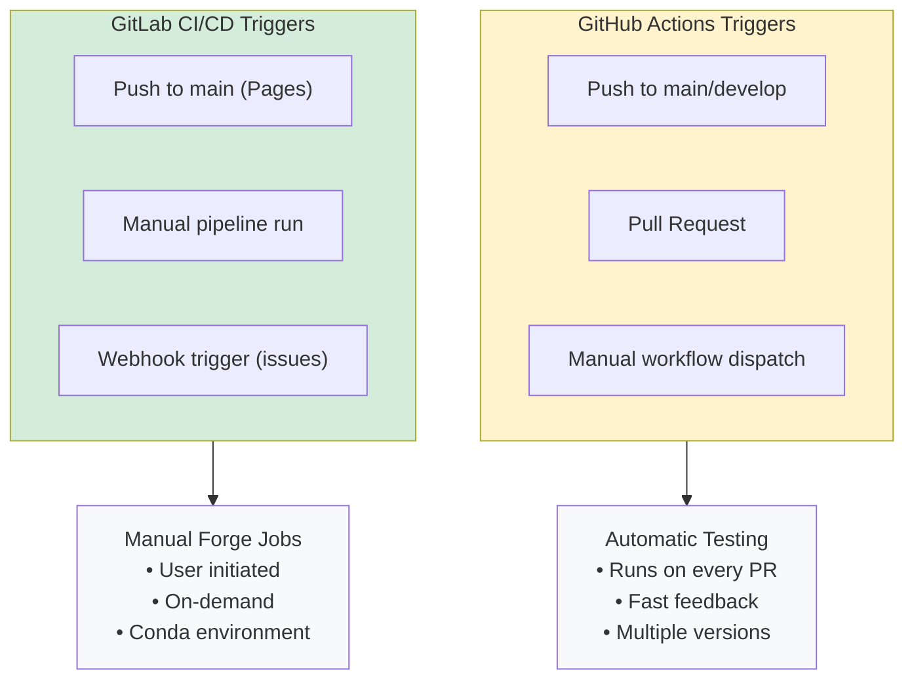
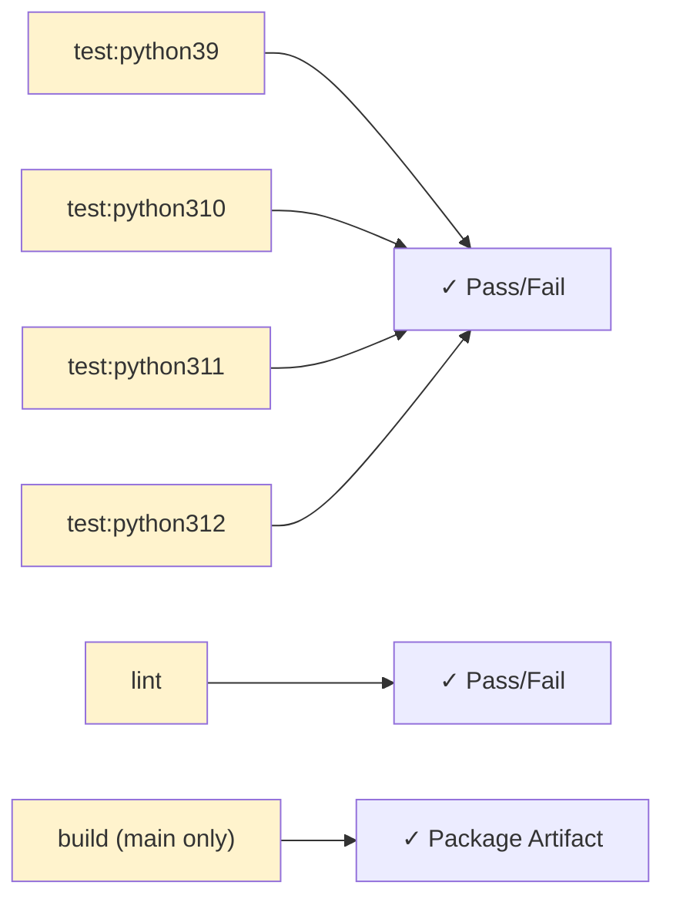
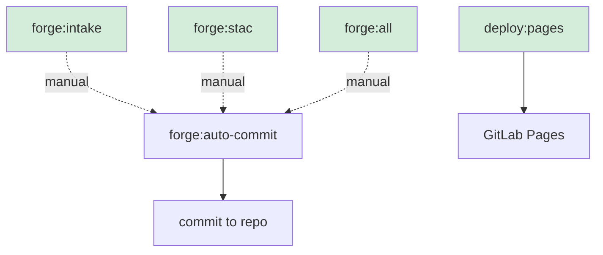
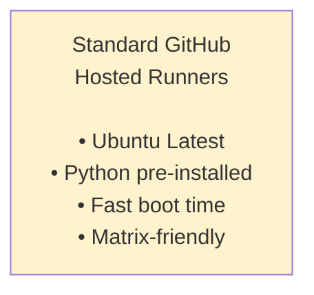
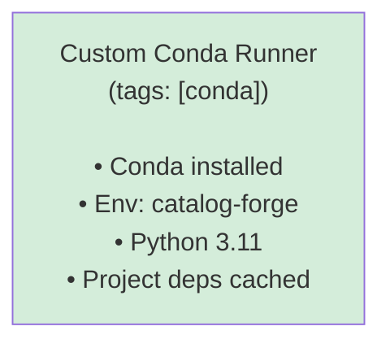
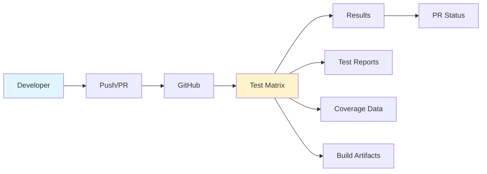
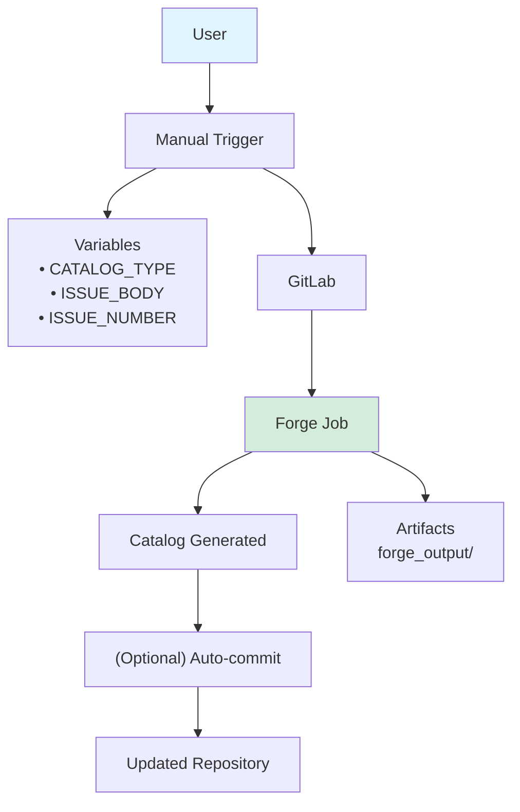
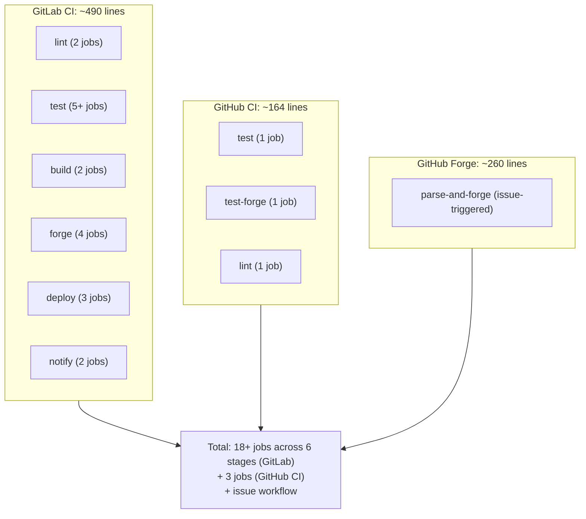
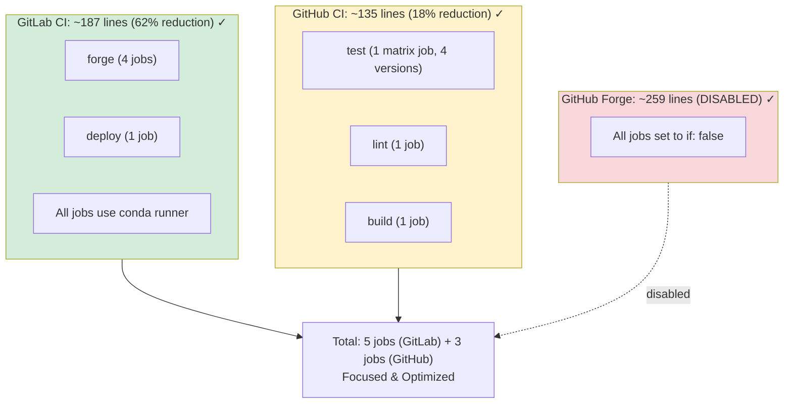

# Architecture - GitLab & GitHub Split

## Visual Overview



## Trigger Flow



## Job Dependencies

### GitHub Actions (Parallel)



### GitLab CI/CD (Sequential)



## Runner Configuration

### GitHub Actions



### GitLab CI/CD



## Data Flow

### Testing Flow (GitHub)



### Forge Flow (GitLab)



## Pipeline Complexity Comparison

### Before Split



### After Split



## Resource Usage Estimate

### Before
```
GitHub Actions:
├── Test matrix: ~10 min × 4 = 40 min
├── Forge testing: ~5 min
└── Lint: ~2 min
Total per run: ~47 minutes

GitLab CI:
├── All stages: ~30-40 min
Total per run: ~35 minutes

Combined: ~82 minutes per full run
```

### After
```
GitHub Actions:
├── Test matrix: ~10 min × 4 = 40 min
├── Lint: ~2 min
└── Build: ~3 min
Total per run: ~45 minutes (5% reduction)

GitLab CI:
├── Forge (manual): ~5-10 min
└── Deploy: ~1 min
Total per run: ~6-11 minutes (70% reduction)

Combined: ~51-56 minutes
Overall savings: ~30-35%
```

## Responsibility Matrix

| Task | GitHub | GitLab |
|------|--------|--------|
| Python Testing | ✅ | ❌ |
| Multi-version Test | ✅ | ❌ |
| Code Linting | ✅ | ❌ |
| Package Building | ✅ | ❌ |
| Catalog Generation | ❌ | ✅ |
| Manual Forge Jobs | ❌ | ✅ |
| Auto-commit | ❌ | ✅ |
| Pages Deployment | ❌ | ✅ |
| Issue Automation | ❌ | ✅ |
| Conda Environment | ❌ | ✅ |

## Configuration Files

```
Repository Root
├── .github/
│   └── workflows/
│       ├── ci.yml              (Testing & Quality - Active)
│       └── forge-catalog.yml   (DISABLED - Notice only)
│
├── .gitlab/
│   ├── scripts/
│   │   └── forge_parser.py     (Forge parser for GitLab)
│   └── ...documentation...
│
├── .gitlab-ci.yml              (Forge & Deploy - Active)
│
└── Documentation
    ├── CI_SPLIT_GUIDE.md
    ├── CI_SPLIT_SUMMARY.md
    └── CI_ARCHITECTURE.md (this file)
```

## Environment Setup

### GitHub Actions Environment
```yaml
Environment: ubuntu-latest
Python: 3.9, 3.10, 3.11, 3.12 (matrix)
Package Manager: pip
Cache: pip cache
Dependencies: Installed per job
Setup Time: ~30 seconds
```

### GitLab CI/CD Environment  
```yaml
Environment: Custom runner with conda
Python: 3.11 (via conda)
Package Manager: conda + pip
Cache: Conda environment
Dependencies: Pre-installed in conda env
Setup Time: ~10 seconds (env exists) or ~2 min (first time)
Tag Required: conda
```

## Success Criteria

✅ **Separation Achieved**
- GitHub handles all testing
- GitLab handles all forge operations
- No overlap or duplication

✅ **Performance Optimized**
- 62% reduction in GitLab pipeline size
- 18% reduction in GitHub pipeline size
- ~30% overall time savings

✅ **Conda Integration**
- All GitLab jobs use conda runner
- Single Python 3.11 environment
- Consistent dependency management

✅ **Documentation Complete**
- Split guide created
- Summary documented
- Architecture visualized

✅ **Backward Compatible**
- GitHub testing unchanged for users
- Forge moved to GitLab with clear instructions
- No breaking changes for contributors

---

**Architecture Version**: 1.0  
**Last Updated**: February 6, 2026  
**Status**: ✅ Production Ready
