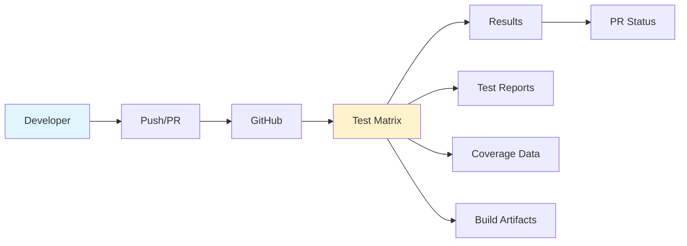
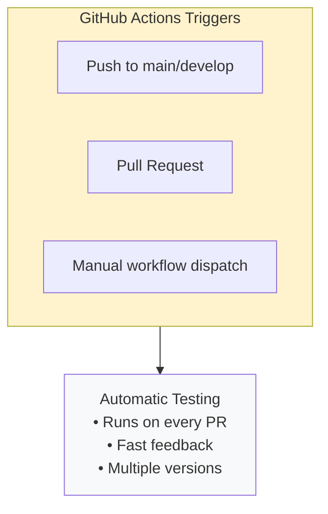

# GitHub Actions - Testing & Quality

GitHub Actions handles multi-version Python testing, code quality checks, and package building.

## Configuration

**Location:** `.github/workflows/ci.yml`

**Jobs:**
1. `test` - Multi-version Python testing
2. `lint` - Code quality checks
3. `build` - Package building

## Runner Environment

**Standard GitHub Hosted Runners:**

- **OS:** Ubuntu Latest
- **Python:** Pre-installed (uses setup-python)
- **Package Manager:** pip + UV
- **Cache:** pip cache
- **Setup time:** ~30 seconds

## Jobs

### Test Job

**Matrix testing across Python versions:**

```yaml
strategy:
  matrix:
    python-version: ['3.9', '3.10', '3.11', '3.12']
```

**Steps:**
1. Checkout code
2. Setup Python version
3. Install dependencies with UV
4. Run pytest with coverage
5. Upload coverage reports

**Runs on:**
- Push to `main` or `develop`
- Pull requests
- Manual workflow dispatch

### Lint Job

**Code quality checks:**

- **Tool:** Ruff
- **Checks:**
  - Code style violations
  - Import ordering
  - Common bugs
  - Complexity issues

**Configuration:**
```yaml
- uses: chartboost/ruff-action@v1
  with:
    src: "./src"
```

### Build Job

**Package building:**

- **Trigger:** Main branch only
- **Tool:** build package
- **Output:** Python wheel and source distribution
- **Upload:** Build artifacts

## Workflow



## Triggers



## Configuration

### Workflow File Structure

```yaml
name: CI

on:
  push:
    branches: [main, develop]
  pull_request:
    branches: [main, develop]
  workflow_dispatch:

jobs:
  test:
    strategy:
      matrix:
        python-version: ['3.9', '3.10', '3.11', '3.12']
    # ... test steps
  
  lint:
    # ... lint steps
  
  build:
    if: github.ref == 'refs/heads/main'
    # ... build steps
```

### Dependencies

**Core:**
- `uv` - Fast Python package manager
- `pytest` - Testing framework
- `pytest-cov` - Coverage plugin
- `ruff` - Linter and formatter

**Optional:**
- `build` - Package building
- `twine` - Package upload (if publishing)

## Running Tests

### Automatic (Recommended)

Tests run automatically on:
- Every push to `main` or `develop`
- Every pull request
- Every commit in a PR

### Manual Trigger

Via GitHub UI:
1. Go to **Actions** tab
2. Select **CI** workflow
3. Click **Run workflow**
4. Select branch
5. Click **Run workflow** button

Via GitHub CLI:
```bash
gh workflow run ci.yml --ref main
```

## Status Checks

### Pull Request Checks

All PRs must pass:
- ✅ Test on Python 3.9
- ✅ Test on Python 3.10
- ✅ Test on Python 3.11
- ✅ Test on Python 3.12
- ✅ Lint checks

### Branch Protection

Recommended settings:
- Require status checks before merging
- Require branches to be up-to-date
- Require at least test-3.11 to pass

## Artifacts

### Test Artifacts

**Coverage Reports:**
- Format: HTML + terminal
- Retention: 90 days
- Download from workflow run

**Test Reports:**
- Format: JUnit XML
- Uploaded to workflow summary
- Visible in PR checks

### Build Artifacts

**Package Files:**
- Wheel (`.whl`)
- Source distribution (`.tar.gz`)
- Retention: 90 days
- Available for download

## Troubleshooting

### Tests Fail on Specific Python Version

**Check compatibility:**
```bash
# Test locally with specific version
pyenv install 3.9.18
pyenv shell 3.9.18
pip install -e ".[dev]"
pytest
```

**Common issues:**
- Dependency version conflicts
- Python version-specific syntax
- Missing backports for older versions

### Lint Failures

**Run locally:**
```bash
pip install ruff
ruff check src/
ruff format src/ --check
```

**Auto-fix:**
```bash
ruff check src/ --fix
ruff format src/
```

### Build Failures

**Check dependencies:**
```bash
pip install build
python -m build
```

**Common issues:**
- Missing `MANIFEST.in`
- Incorrect `pyproject.toml`
- Missing package files

### Slow Test Runs

**Optimization tips:**
- Use test markers to run subsets
- Parallelize with pytest-xdist
- Cache dependencies effectively
- Skip slow tests in CI

## Best Practices

**Do:**
- ✅ Run tests locally before pushing
- ✅ Keep tests fast (<5 min total)
- ✅ Use test markers for organization
- ✅ Monitor coverage trends
- ✅ Fix flaky tests immediately

**Don't:**
- ❌ Skip failing tests
- ❌ Commit without running lint
- ❌ Use print debugging in CI
- ❌ Ignore version-specific failures
- ❌ Run forge jobs on GitHub (use GitLab)

## Resource Usage

**Test Job:**
- Per Python version: ~10 minutes
- Total (4 versions): ~40 minutes
- Parallel execution

**Lint Job:**
- Duration: ~2 minutes
- Runs in parallel with tests

**Build Job:**
- Duration: ~3 minutes
- Main branch only

**Monthly Estimate:**
- ~100 PRs/pushes: ~4,500 minutes
- Well within GitHub free tier (2,000 minutes + unlimited for public repos)

## Integration with Pull Requests

### PR Workflow

1. Developer creates PR
2. GitHub Actions triggered automatically
3. Tests run in parallel
4. Results posted to PR
5. Status checks updated
6. Review + merge when green

### PR Comments

GitHub Actions can:
- Post test results
- Show coverage changes
- Highlight failing tests
- Link to full logs

### Status Badges

Add to `README.md`:
```markdown

```

## Local Development

### Running Tests Locally

```bash
# Install dependencies
pip install -e ".[dev]"

# Run all tests
pytest

# Run specific test
pytest tests/test_specific.py

# Run with coverage
pytest --cov=src --cov-report=html
```

### Lint Checks

```bash
# Check code
ruff check src/

# Format code
ruff format src/

# Both
ruff check src/ --fix && ruff format src/
```

### Build Package

```bash
# Install build
pip install build

# Build package
python -m build

# Check dist/
ls -lh dist/
```

## Migration Notes

### GitHub Forge Disabled

The `.github/workflows/forge-catalog.yml` workflow is **DISABLED**:
- Issue triggers commented out
- All jobs have `if: false`
- Notice job explains migration to GitLab

**Use GitLab CI/CD** for all forge operations.

### No Breaking Changes

For developers:
- PR workflow unchanged
- Test requirements same
- Merge process identical

## Advanced Configuration

### Custom Test Matrix

```yaml
strategy:
  matrix:
    include:
      - python-version: '3.9'
        os: ubuntu-latest
      - python-version: '3.12'
        os: macos-latest
```

### Conditional Jobs

```yaml
build:
  if: github.ref == 'refs/heads/main' && github.event_name == 'push'
```

### Secrets and Variables

**Repository secrets:**
- `PYPI_TOKEN` - For package publishing
- Other credentials as needed

**Variables:**
- Set in repository settings
- Available as `${{ secrets.NAME }}`
