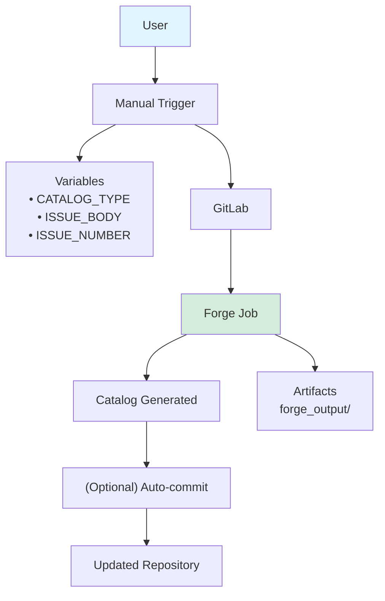

# GitLab CI/CD - Forge & Deploy

GitLab CI/CD handles catalog generation (Forge) and Pages deployment using custom conda runners.

## Configuration

**Location:** `.gitlab-ci.yml`

**Stages:**
1. `setup` - Dependency installation with UV
2. `forge` - Catalog generation jobs
3. `deploy` - GitLab Pages deployment

## Runner Setup

**Custom Conda Runner:**

- **Tags:** `[conda]` (required for all forge jobs)
- **Environment:** Python 3.11 via conda
- **Setup time:** ~10 seconds (env exists) or ~2 min (first time)
- **Cache:** Conda environment + UV cache

## Jobs

### Setup Job

**`uv:setup`** - Install dependencies

```yaml
- uv sync --all-extras
- uv cache prune --ci
```

### Forge Jobs (Manual)

All forge jobs extend `.forge_template` and inherit:
- Conda runner requirement
- UV-based dependency management
- Environment variable support
- Artifact generation

**`forge:intake`** - Generate Intake v2 catalog

- **Type:** Manual trigger
- **Variables:**
  - `CATALOG_TYPE`: "intake"
  - `ISSUE_BODY`: Catalog specification
  - `ISSUE_NUMBER`: Issue identifier

**`forge:stac`** - Generate STAC catalog

- **Type:** Manual trigger
- **Variables:**
  - `CATALOG_TYPE`: "stac"
  - `ISSUE_BODY`: Collection specification
  - `ISSUE_NUMBER`: Issue identifier

**`forge:all`** - Generate both catalog types

- **Type:** Manual trigger
- **Variables:**
  - `CATALOG_TYPE`: "all"
  - `ISSUE_BODY`: Combined specification
  - `ISSUE_NUMBER`: Issue identifier

**`forge:create-merge-request`** - Create MR with generated catalogs

- **Needs:** Any forge job completion
- **Requires:** `CI_PUSH_TOKEN` and `GITHUB_TOKEN` variables

### Deploy Job

**`pages`** - Build and deploy GitLab Pages

- **Trigger:** Automatic on main branch
- **Builds:** Sphinx documentation
- **Copies:** Catalog directory to public
- **Output:** `public/` directory for Pages

## Data Flow



## Running Forge Jobs

### Manual Execution

1. Navigate to **CI/CD > Pipelines**
2. Click **Run Pipeline**
3. Select branch: `main`
4. Add variables:
   ```
   CATALOG_TYPE: intake
   ISSUE_BODY: <catalog specification>
   ISSUE_NUMBER: manual-001
   ```
5. Click **Run Pipeline**
6. Find the forge job and click **▶️**
7. Download artifacts after completion

### Via GitHub Issues (Webhook)

1. Create issue on GitHub using forge template
2. Fill in catalog details
3. Submit issue
4. GitHub webhook triggers GitLab pipeline
5. Forge job runs automatically
6. Results posted back to GitHub issue

## Environment Variables

### Required

- `ISSUE_BODY` - Catalog specification (from issue or manual)
- `ISSUE_NUMBER` - Issue identifier
- `CATALOG_TYPE` - "intake", "stac", or "all"

### Optional

- `CI_PUSH_TOKEN` - For merge request creation
- `GITHUB_TOKEN` - For GitHub issue comments
- `GITHUB_ISSUE_NUMBER` - GitHub issue number
- `GITHUB_ISSUE_BODY` - GitHub issue body

## Configuration

### Required Setup

**CI/CD Variables** (Settings > CI/CD > Variables):
- `CI_PUSH_TOKEN`: GitLab access token with API and write_repository scopes

**Runner Requirements:**
- Conda runner with `conda` tag
- Python 3.11 environment available
- UV package manager installed

### Pipeline Configuration

```yaml
# Global variables
variables:
  UV_VERSION: "0.5"
  PYTHON_VERSION: "3.12"
  UV_CACHE_DIR: .uv-cache
  PAGES_BRANCH: "main"
```

## Artifacts

**Forge Output:**
- Location: `forge_output/`
- Contents:
  - Generated catalog files (`.yaml`, `.json`)
  - `info.txt` - Generation details
  - `error.log` - Error details (if failed)
  - `duplicate_warning.txt` - Duplicate warnings (if applicable)
- Retention: 5 days

**Pages Output:**
- Location: `public/`
- Contents:
  - Built Sphinx documentation
  - Catalog directory
  - README files
- Retention: 30 days

## Troubleshooting

### Pipeline Doesn't Start
- Check workflow rules in `.gitlab-ci.yml`
- Ensure runner with `conda` tag is available
- Verify CI/CD is enabled in project settings

### Conda Environment Fails
- Check runner has conda installed
- Verify Python 3.11 is available
- Check conda environment activation

### Forge Job Fails
- Verify `ISSUE_BODY` format matches templates
- Check all dependencies are installed
- Review `forge_output/error.log` in artifacts
- Ensure `CATALOG_TYPE` is valid

### Pages Not Deploying
- Check job runs on `main` branch only
- Verify `public/` directory is created
- Ensure Sphinx build succeeds
- Check Pages settings are enabled

## Best Practices

**Do:**
- ✅ Use manual triggers for testing
- ✅ Review artifacts before merging
- ✅ Keep conda environment updated
- ✅ Monitor pipeline duration
- ✅ Clean up old artifacts

**Don't:**
- ❌ Run forge jobs in parallel
- ❌ Skip variable validation
- ❌ Commit large binary files
- ❌ Use forge for testing (use GitHub)
- ❌ Override conda runner tag

## Resource Usage

**Typical Forge Job:**
- Setup: ~10 seconds (cached env)
- Execution: 5-10 minutes
- Total: ~6-11 minutes

**Pages Deployment:**
- Sphinx build: ~1 minute
- Copy files: <10 seconds

**Monthly Estimate:**
- 10 forge runs: ~100 minutes
- Daily deployments: ~30 minutes
- Total: ~130 minutes/month
